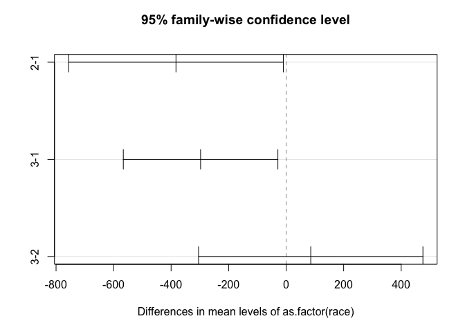

Untitled
================
bowen xia
2025-10-14

\#problem 1

``` r
library(MASS)
data(birthwt)

smoke_yes <- birthwt$lwt[birthwt$smoke == 1]
smoke_no <- birthwt$lwt[birthwt$smoke == 0]

# Part (a): Test for equality of variances at α = 0.05
var_test <- var.test(smoke_yes, smoke_no)
print(var_test)
```

    ## 
    ##  F test to compare two variances
    ## 
    ## data:  smoke_yes and smoke_no
    ## F = 1.4126, num df = 73, denom df = 114, p-value = 0.09744
    ## alternative hypothesis: true ratio of variances is not equal to 1
    ## 95 percent confidence interval:
    ##  0.9388406 2.1671700
    ## sample estimates:
    ## ratio of variances 
    ##           1.412636

``` r
# Part (b): Decision based on variance test
# If p-value > 0.05, use pooled variance t-test
# If p-value ≤ 0.05, use Welch's t-test

# Part (c): Hypothesis test at α = 0.10
if(var_test$p.value > 0.05) {
  # Equal variances - use pooled t-test
  t_test <- t.test(smoke_yes, smoke_no, var.equal = TRUE, 
                   alternative = "two.sided", conf.level = 0.90)
} else {
  t_test <- t.test(smoke_yes, smoke_no, var.equal = FALSE, 
                   alternative = "two.sided", conf.level = 0.90)
}
print(t_test)
```

    ## 
    ##  Two Sample t-test
    ## 
    ## data:  smoke_yes and smoke_no
    ## t = -0.60473, df = 187, p-value = 0.5461
    ## alternative hypothesis: true difference in means is not equal to 0
    ## 90 percent confidence interval:
    ##  -10.306448   4.785414
    ## sample estimates:
    ## mean of x mean of y 
    ##  128.1351  130.8957

``` r
# Part (d): 95% CI for difference in means
ci_95 <- t.test(smoke_yes, smoke_no, var.equal = (var_test$p.value > 0.05), 
                conf.level = 0.95)
print(ci_95$conf.int)
```

    ## [1] -11.765783   6.244749
    ## attr(,"conf.level")
    ## [1] 0.95

\#problem2

``` r
# Part (a): 95% CI for rate of uterine irritability among smokers
ui_smokers <- birthwt$ui[birthwt$smoke == 1]
n_smokers <- length(ui_smokers)
x_smokers <- sum(ui_smokers)
p_hat_smokers <- x_smokers / n_smokers

prop_test_smokers <- prop.test(x_smokers, n_smokers, conf.level = 0.95)
print(prop_test_smokers)
```

    ## 
    ##  1-sample proportions test with continuity correction
    ## 
    ## data:  x_smokers out of n_smokers, null probability 0.5
    ## X-squared = 29.851, df = 1, p-value = 4.665e-08
    ## alternative hypothesis: true p is not equal to 0.5
    ## 95 percent confidence interval:
    ##  0.1004347 0.2853177
    ## sample estimates:
    ##         p 
    ## 0.1756757

``` r
# Part (b): 95% CI for difference in rates
ui_nonsmokers <- birthwt$ui[birthwt$smoke == 0]
n_nonsmokers <- length(ui_nonsmokers)
x_nonsmokers <- sum(ui_nonsmokers)

prop_test_diff <- prop.test(c(x_smokers, x_nonsmokers), 
                             c(n_smokers, n_nonsmokers), 
                             conf.level = 0.95)
print(prop_test_diff)
```

    ## 
    ##  2-sample test for equality of proportions with continuity correction
    ## 
    ## data:  c(x_smokers, x_nonsmokers) out of c(n_smokers, n_nonsmokers)
    ## X-squared = 0.41576, df = 1, p-value = 0.5191
    ## alternative hypothesis: two.sided
    ## 95 percent confidence interval:
    ##  -0.07219452  0.16267631
    ## sample estimates:
    ##    prop 1    prop 2 
    ## 0.1756757 0.1304348

``` r
# Part (c): Hypothesis test at α = 0.01
prop_test_hyp <- prop.test(c(x_smokers, x_nonsmokers), 
                            c(n_smokers, n_nonsmokers), 
                            conf.level = 0.99)
print(prop_test_hyp)
```

    ## 
    ##  2-sample test for equality of proportions with continuity correction
    ## 
    ## data:  c(x_smokers, x_nonsmokers) out of c(n_smokers, n_nonsmokers)
    ## X-squared = 0.41576, df = 1, p-value = 0.5191
    ## alternative hypothesis: two.sided
    ## 99 percent confidence interval:
    ##  -0.1056061  0.1960879
    ## sample estimates:
    ##    prop 1    prop 2 
    ## 0.1756757 0.1304348

``` r
cat("p-value:", prop_test_hyp$p.value, "\n")
```

    ## p-value: 0.5190613

``` r
cat("Decision: ", ifelse(prop_test_hyp$p.value < 0.01, 
                         "Reject H0", "Fail to reject H0"), "\n")
```

    ## Decision:  Fail to reject H0

\#problem3

``` r
# Part (a): Most appropriate test - ANOVA (comparing means across >2 groups)

# Part (b): Check assumptions
# 1. Independence - assumed from study design
# 2. Normality - check with Shapiro-Wilk or QQ plots
# 3. Equal variances - check with Levene's test

library(car)
```

    ## Loading required package: carData

``` r
race1 <- birthwt$bwt[birthwt$race == 1]
race2 <- birthwt$bwt[birthwt$race == 2]
race3 <- birthwt$bwt[birthwt$race == 3]

shapiro.test(race1)
```

    ## 
    ##  Shapiro-Wilk normality test
    ## 
    ## data:  race1
    ## W = 0.98727, p-value = 0.4861

``` r
shapiro.test(race2)
```

    ## 
    ##  Shapiro-Wilk normality test
    ## 
    ## data:  race2
    ## W = 0.97696, p-value = 0.8038

``` r
shapiro.test(race3)
```

    ## 
    ##  Shapiro-Wilk normality test
    ## 
    ## data:  race3
    ## W = 0.97537, p-value = 0.2046

``` r
leveneTest(bwt ~ as.factor(race), data = birthwt)
```

    ## Levene's Test for Homogeneity of Variance (center = median)
    ##        Df F value Pr(>F)
    ## group   2  0.4684 0.6267
    ##       186

``` r
# Part (c): ANOVA test at α = 0.05
anova_result <- aov(bwt ~ as.factor(race), data = birthwt)
summary(anova_result)
```

    ##                  Df   Sum Sq Mean Sq F value  Pr(>F)   
    ## as.factor(race)   2  5015725 2507863   4.913 0.00834 **
    ## Residuals       186 94953931  510505                   
    ## ---
    ## Signif. codes:  0 '***' 0.001 '**' 0.01 '*' 0.05 '.' 0.1 ' ' 1

``` r
# Part (d): Multiple comparisons (Tukey HSD)
tukey_result <- TukeyHSD(anova_result, conf.level = 0.95)
print(tukey_result)
```

    ##   Tukey multiple comparisons of means
    ##     95% family-wise confidence level
    ## 
    ## Fit: aov(formula = bwt ~ as.factor(race), data = birthwt)
    ## 
    ## $`as.factor(race)`
    ##           diff       lwr        upr     p adj
    ## 2-1 -383.02644 -756.2363  -9.816581 0.0428037
    ## 3-1 -297.43517 -566.1652 -28.705095 0.0260124
    ## 3-2   85.59127 -304.4521 475.634630 0.8624372

``` r
plot(tukey_result)
```

<!-- -->
